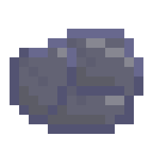

# Cerium

## Usage
This application is a procedural slideshow video generator.  
You provide a configuration path, and the video is generated using [FFMPEG](https://ffmpeg.org/).  

### Features:
- Randomizable configs
- Video in/out transitions
- Video effects
- Slide transitions
- Image effects
- Image scaling options
- Audio

## CLI
Pass it the config file path.  

## Installation
This application is available for Windows, Linux and MacOS.  
Download an executable from the [Releases](https://github.com/siljamdev/cerium/releases/latest).  

## Requirements
[FFMPEG](https://ffmpeg.org/) installed. The ffmpeg executable path will be `ffmpeg` by default, but can be changed in the configuration file.  

## Configuration
Configuration files are `.conf` files with one option per line. Blank lines or lines starting with `#` will be ignored.  
Option format: `option: arg1 arg2 "arg 3"`.  

List of valid options:  
|Option|Number of args|Args|Default value|Description|
|---|---|---|---|---|
|`priority`|1|[priority](#priority)|`merge`|Sets the priority of the current file. Determines its behaviour on include|
|`include`|non 0|`config path 1`, `config path 2`, ...||Chooses randomly and includes one of the configs, based on its path. Use `none` to include nothing|
|`seed`|1|`number`|System time dependant|Sets the random number generator seed for this config|
|`ffmpeg_path`|1|`ffmpeg executable path`|`ffmpeg`|Sets the path to FFMPEG executable|
|`video_out`|1|`out path`|`%d_%h`|Sets the output path for the generated video. `%d` will be replaced by the date, and `%h` by the hour|
|`video_dims`|2|`width`, `height`|`1920`, `1080`|Sets the output video dimensions in pixels|
|`video_width`|1|`number`|`1920`|Sets the output video width in pixels|
|`video_height`|1|`number`|`1080`|Sets the output video height in pixels|
|`video_framerate`|1|`number`|`30`|Sets the output video framerate in Hz (FPS)|
|`video_filter`|1|[filter](#filter)|`none`|Sets the output video filter|
|`in_transition`|2 or 3|[video transition effect](#video transition effect), `duration` or [video transition](#video transition), `min duration`, `max duration`|`none`, `0`|Sets the transition at the start of the video, with an effect and a duration (in seconds) inside a random range|
|`in_transition_effect`|1|[video transition effect](#video transition effect)|`none`|Sets the effect of the transition at the start of the video|
|`in_transition_dur`|1 or 2|`duration` or `min duration`, `max duration`|`0`|Sets the duration (in seconds) of the transition at the start of the video, inside a random range|
|`in_transition_dur_min`|1|`min duration`|`0`|Sets the minimum duration (in seconds) of the transition at the start of the video, for a random range|
|`in_transition_dur_max`|1|`max duration`|`0`|Sets the maximum duration (in seconds) of the transition at the start of the video, for a random range|
|`out_transition`|2 or 3|[video transition effect](#video transition effect), `duration` or [video transition](#video transition), `min duration`, `max duration`|`none`, `0`|Sets the transition at the end of the video, with an effect and a duration (in seconds) inside a random range|
|`out_transition_effect`|1|[video transition effect](#video transition effect)|`none`|Sets the effect of the transition at the end of the video|
|`out_transition_dur`|1 or 2|`duration` or `min duration`, `max duration`|`0`|Sets the duration (in seconds) of the transition at the end of the video, inside a random range|
|`out_transition_dur_min`|1|`min duration`|`0`|Sets the minimum duration (in seconds) of the transition at the end of the video, for a random range|
|`out_transition_dur_max`|1|`max duration`|`0`|Sets the maximum duration (in seconds) of the transition at the end of the video, for a random range|
|`slide_count`|1 or 2|`count` or `min count`, `max count`|`1`, `10`|Sets the number of slides the video will have, as a random range|
|`slide_count_min`|1|`min count`|`1`|Sets the minimum number of slides the video will have, as a random range|
|`slide_count_max`|1|`max count`|`10`|Sets the maximum number of slides the video will have, as a random range|
|`slide_fill_color`|1|[color](#color)|`black`|Sets the color for paddding all slides. Images are scaled to fit either widthwise or heightwise, and then padded with this color|
|`def_slide_dur`|1 or 2|`duration` or `min duration`, `max duration`|`1`|Sets the default duration (in seconds) of slides, as a random range|
|`def_slide_dur_min`|1|`min duration`|`1`|Sets the default duration (in seconds) of slides, as a random range|
|`def_slide_dur_max`|1|`max duration`|`1`|Sets the default duration (in seconds) of slides, as a random range|
|`slide_dur`|2 or 3|[slide index](#slide index), `duration` or [slide index](#slide index), `min duration`, `max duration`||Sets the duration (in seconds) of a slide in particular, as a random range|
|`slide_dur_min`|2|[slide index](#slide index), `min duration`||Sets the minimum duration (in seconds) of a slide in particular, inside a random range|
|`slide_dur_max`|2|[slide index](#slide index), `max duration`||Sets the minimum duration (in seconds) of a slide in particular, inside a random range|
|`def_slide_transition`|2 or 3|[slide transition effect](#slide transition effect), `duration` or [slide transition effect](#slide transition effect), `min duration`, `max duration`|`none`, `0`|Sets the default transition between slides, with an effect and a duration (in seconds) inside a random range|
|`def_slide_transition_effect`|1|[slide transition effect](#slide transition effect)|`none`, `0`|Sets the effect of the default transition between slides|
|`def_slide_transition_dur`|1 or 2|`duration` or `min duration`, `max duration`|`0`|Sets the duration (in seconds) of the default transition between slides, inside a random range|
|`def_slide_transition_dur_min`|1|`min duration`|`0`|Sets the minimum duration (in seconds) of the default transition between slides, inside a random range|
|`def_slide_transition_dur_max`|1|`max duration`|`0`|Sets the maximum duration (in seconds) of the default transition between slides, inside a random range|
|`slide_transition`|3 or 4|[slide index](#slide index), [slide transition effect](#slide transition effect), `duration` or [slide index](#slide index), [slide transition effect](#slide transition effect), `min duration`, `max duration`||Sets the transition between the specified slide and the next, with an effect and a duration (in seconds) inside a random range|
|`slide_transition_effect`|2|[slide index](#slide index), [slide transition effect](#slide transition effect)||Sets the effect of the transition between the specified slide and the next|
|`slide_transition_dur`|2 or 3|[slide index](#slide index), `duration` or [slide index](#slide index), `min duration`, `max duration`||Sets the duration (in seconds) of the transition between the specified slide and the next, inside a random range|
|`slide_transition_dur_min`|2|[slide index](#slide index), `min duration`||Sets the minimum duration (in seconds) of the transition between the specified slide and the next, inside a random range|
|`slide_transition_dur_max`|2|[slide index](#slide index), `max duration`||Sets the maximum duration (in seconds) of the transition between the specified slide and the next, inside a random range|
|`def_slide_filter`|1|[filter](#filter)|`none`|Sets the default filter for the images of all slides|
|`slide_filter`|2|[slide index](#slide index), [filter](#filter)||Sets the filter for the image of a specific slide|
|`def_slide_scaling`|1|[scaling](#scaling)|`neighbor`|Sets the default scaling technique for the images of all slides|
|`slide_scaling`|2|[slide index](#slide index), [scaling](#scaling)||Sets the scaling technique for the image of a specific slide|
|`slide_image`|2|[slide index](#slide index), `image path`||Sets the image for a specific slide with its file path|
|`image_selection_mode`|1|[image selection mode](#image selection mode)|`random`|Sets how the images for the slides will be chosen from the pool|
|`image_pool`|non 0|`path to folder`||Adds all the images to the image pool|
|`image_folder`|1|`path to folder`||Adds to the image pool all the [images](#Image extensions) inside the folder|
|`audio_pool`|non 0|`path to folder`||Adds all the audios to the audio pool|
|`audio_folder`|1|`path to folder`||Adds to the audio pool all the [audios](#Audio extensions) inside the folder|
|`audio_filter`|1|[audio filter](#audio filter)|`none`|Sets the filter for the audio chosen from the audio pool (if any)|

### Types of arguments:

#### priority
Possible values:
- `ignore`: All values will be ignored unless the parent config values arent defined
- `override`: All defined values override the parent config values
- `merge`: All values will be merged, the parent config having priority
- `mergeReverse`: All values will be merged, this config having priority

#### filter
Possible values:
- `none`: No filter
- `grayscale`: No colors, just grayscale
- `pixelize16`: Pixelize, 16 pixels wide
- `pixelize32`: Pixelize, 32 pixels wide
- `pixelize64`: Pixelize, 64 pixels wide
- `pixelize128`: Pixelize, 128 pixels wide
- `pixelize256`: Pixelize, 256 pixels wide
- `pixelize512`: Pixelize, 512 pixels wide
- `pixelize16grayscale`: Pixelize, 16 pixels wide, and grayscale
- `pixelize32grayscale`: Pixelize, 32 pixels wide, and grayscale
- `pixelize64grayscale`: Pixelize, 64 pixels wide, and grayscale
- `pixelize128grayscale`: Pixelize, 128 pixels wide, and grayscale
- `pixelize256grayscale`: Pixelize, 256 pixels wide, and grayscale
- `pixelize512grayscale`: Pixelize, 512 pixels wide, and grayscale
- `sepia`: Sepia coloring filter
- `invert`: Invert colors
- `warm`: Warm coloring
- `cool`: Cool coloring
- `blur`: Blur with a middle intensity
- `blurstrong`: Really strong blur
- `blursubtle`: Subtle blur
- `blurgrayscale`: Blur with a middle intensity, and grayscale
- `blurstronggrayscale`: Really strong blur, and grayscale
- `blursubtlegraysclae`: Subtle blur, and grayscale
- `sharp`: Sharpen image
- `sharpgrayscale`: Sharpen image, and grayscale
- `edge`: Edge detection. White edges over black background
- `edgeinvert`: Edge detection. Black edges over white background
- `posterize`: Posterize images to 16 values by channel
- `posterizestrong`: Posterize images to 4 values by channel
- `posterizegrayscale`: Posterize images to 32 values, and grayscale
- `posterizestronggrayscale`: Posterize images to 4 values, and grayscale
- `glitch`: Channel shift, glitch effect
- `noise`: Grayscale noise. Static if applied to image, dynamic if applied to video
- `noisecolor`: Colored noise. Static if applied to image, dynamic if applied to video
- `vibrant`: Vibrancy increasy
- `vhs`: VHS-like: blur, noise, saturation, contrast and convolution

#### video transition effect
Possible values:
- `none`: No transition
- `black`: Transitions to/from black background
- `white`: Transitions to/from white background

#### color
Possible values:
- `black`: Black color
- `white`: White color
- `#RRGGBB`: Any color in hex

#### slide index
Refers to a slide. First slide in the video is slide 1, second is slide 2. NOT ZERO INDEXING.  

#### slide transition effect
Translate directly to [xfade](https://trac.ffmpeg.org/wiki/Xfade) transitions. Possible values:
- `none`: No transition
- `fade`: `fade`
- `black`: `fadeblack`
- `white`: `fadewhite`
- `slidedown`: `slidedown`
- `slideup`: `slideup`
- `slideleft`: `slideleft`
- `slideright`: `slideright`
- `sliderandom`: Randomly chooses between `slidedown`, `slideup`, `slideleft` and `slideright`
- `wipedown`: `wipedown`
- `wipeup`: `wipeup`
- `wipeleft`: `wipeleft`
- `wiperight`: `wiperight`
- `wiperandom`: Randomly chooses between `wipedown`, `wipeup`, `wipeleft` and `wiperight`
- `zoomin`: `zoomin`
- `zoomout`: `zoomout`
- `distance`: `distance`
- `burn`: `fadegrays`

#### scaling
Possible values:
- `neighbor`: Nearest neighbor, blocky look
- `bilinear`: Smooth linear interpolation
- `bicubic`: Smooth interpolation, better quality than bilinear
- `area`: Area averaging, good for downscaling
- `bicublin`: Bicubic+lanczos
- `sinc`: Sinc interpolation, high quality, but can introduce artifacts
- `spline`: Spline interpolation,  natural looking gradients
- `lanczos`: Lanczos resampling, sharp and detailed, very good quality
- `fastbilinear`: Simplified, faster bilinear
- `gauss`: Gaussian scaling filter, softens the image

#### image selection mode
Possible values:
- `random`: Randomly chooses any image from the pool for the slide
- `unique`: Randomly chooses any image from the pool, but doesnt repeat images until all have been used
- `order`: Chooses images in the order they were added

#### audio filter
Possible values:
- `none`: No filter
- `bassboost`: Bass boosted
- `tremble`: Tremble filter
- `echo`: Echo filter
- `reverb`: Reverberation (not very good quality)
- `softclip`: Softclip filter
- `bitcrush`: Bitcrushing filter
- `radio`: Radio-like filter
- `vhs`: Vhs-like filter
- `vinyl`: Vinyl-like filter
- `underwater`: Underwater-like filter
- `dreamy`: Dreamy filter
- `lowquality`: Low quality audio filter

### Example config
Find a complete config file with all options [here](docs/complete.conf).  

### Image extensions
The image extensions for `image_folder` are:
`.jpg`, `.jpeg`, `.png`, `.bmp`, `.gif`, `.tif`, `.tiff`, `.tga`, `.webp`, `.avif`

### Audio extensions
The image extensions for `audio_folder` are:
`.mp3`, `.wav`, `.m4a`, `.aac`, `.ogg`, `.wma`, `.flac`

## License
This software is licensed under the [MIT License](./LICENSE).